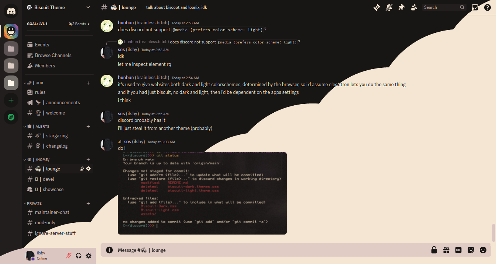

<h3 align="center">
  <br/>
  <br/>
  Biscuit for <a href="https://discord.com">Discord</a>
</h3>

<p align="center">
  
</p>

<p align="center">
  
</p>

### 📥 Installation
>[!NOTE]
>This guide will guess that you are using Vesktop, but it should be similar to other Discord modifiers.

1. Clone the repository locally:
   ```sh
   git clone --depth 1 https://github.com/Biscuit-Theme/discord.git
   ```
   In the case you can't use Git, or simply can't install it; go to the green button top right (the 'Code' button). After doing so, click on 'Download ZIP' and save it.
2. Move the files over to  `~/.config/vesktop/themes`:
   ```sh
   mv discord/*.css .config/vesktop/themes # This is guessing that you're in your HOME directory.
   ```
   This may vary depending on your Discord modifier, as well as your Discord client.
3. Check that the files have been moved correctly:
   ```sh
   cd .config/vesktop/themes && ls -l # Again, this is guessing that you're still in your HOME directory.
   ```
   That should list all the files inside your `~/.config/vesktop/themes` folder, if you see both `Biscuit-Light.css` and `Biscuit-Dark.css`; you've installed it correctly! Congrats!

### 📦 Activating
Go to your settings (cog icon), and scroll down until you see a "Themes" line  under the "Vencord" section. Click on the toggle and you should be good to go.


### 💝 Thanks To
Thanks to all these amazing people for their work!
<a href="https://github.com/Biscuit-Theme/discord/graphs/contributors">

</a>
